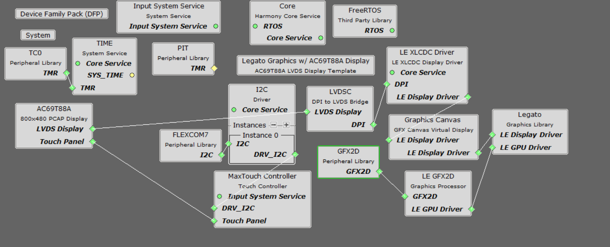
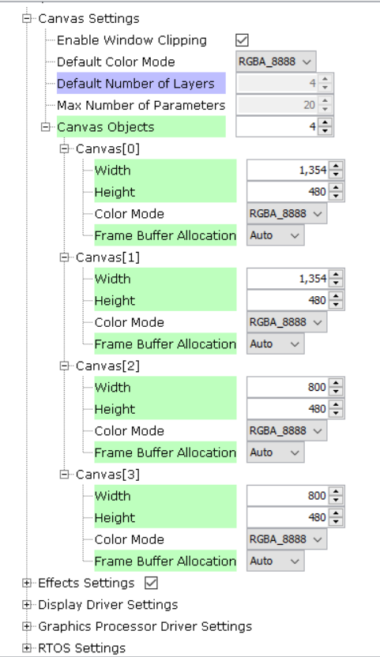
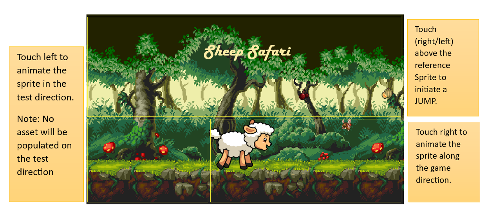

legato_canvas_adv_9x75_eb_ac69t88a_rtos.X

Defining the Architecture
-------------------------

This application demonstrates multi-layer WVGA graphics with FreeRTOS using DDR3 memory.
The demo utilizes pre-processed sprite images stored in DDR3 memory overlaid on top of two-layer scrolling background images intended to achieve parallax scrolling effect. The application code uses the Graphic Canvas library to configure sprite animations and overlaid using XLCDC layers

User touch input on the display panel is received through the capacitive touch controller, which sends a notification to the Touch Input Driver. The Touch Input Driver reads the touch information over I2C and sends the touch event to the Graphics Library through the Input System Service. The navigation of character sprite is based on the location of touch events on the screen.

### Demonstration Features

-   Legato Graphics Library
-   Signature application for the SAM9X75-DDR3-EB Early Access Evaluation Board
-   24-bit color, multi-layer, WVGA (800x480) screen design
-   Time system service, RTT peripheral library and driver
-   Graphics Acceleration using integrated display controller (XLCDC)
-   GFX2D GPU Driver Support
-   I2C and maXTouch® controller driver

Creating the Project Graph
--------------------------

The Project Graph diagram shows the Harmony 3 components that are included in this application. Lines between components are drawn to satisfy components that depend on a capability that another component provides.

Adding the **SAM 9X75 Evaluation Board BSP** and **Legato Graphics w/ AC69T88A Display** Graphics Template component into the project graph will automatically add the components needed for a graphics project and resolve their dependencies. It will also configure the pins needed to drive the external peripherals like the display and the touch controller.

The Graphics Canvas component is added between the XLCDC and the legato graphics library to enable the use of the XLCDC layers to overlay multiple layers, frames and to perform the sprite animations. Inside the canvas component, 4 canvas objects were configured to manage the overlay of scrolling backgrounds, Character sprite and other game assets respectively.

**Graphics Canvas**

Building the Application
------------------------

The parent directory for this application is gfx/apps/legato\_adventure. To build this application, use MPLAB X IDE to open the gfx/apps/legato\_adventure/firmware/legato\_canvas\_adv\_9x75\_eb\_ac69t88a_rtos.X project folder and press F11.
A successful build will generate a harmony.bin file in dist/lvdsc_xlcdc_rtos_rgba8888_mxt_9x75_wvga/production in the project folder.

The following table lists configuration properties:

|Project Name|BSP Used|Graphics Template Used|Description|
|:-----------|:-------|:---------------------|:----------|
|legato\_canvas\_adv\_9x75\_eb\_ac69t88a_rtos.X|[SAM 9X75 Evaluation Board BSP](https://www.microchip.com/en-us/development-tool/EA14J50A) |Legato Graphics w/ Microchip AC69T88A Display|[SAM9X75-DDR3-EB Early Access Evaluation Board](https://www.microchip.com/en-us/development-tool/EA14J50A) with LVDS Interface and [MPU32 LVDS Display WVGA](https://www.microchip.com/)|

> **NOTE:** This application may contain custom code that is marked by the comments // START OF CUSTOM CODE ... and // END OF CUSTOM CODE. When using the MPLAB Code Configurator to regenerate the application code, do not remove or replace the custom code.

Configuring the Hardware
------------------------

Configure the hardware as follows:
-   Connect the MPU32-EB-LVDS-ADAPTER - REV2 add-on board to the SAM 9X75 Evaluation Board. Make sure to remove any jumpers on the marked areas and start by inserting the mikroBUS header first for easy alignment.  **Note:** Please contact your local [Microchip Sales Office](https://www.microchip.com/en-us/about/global-sales-and-distribution) for access to the LVDS adapter and LVDS display.

-   Connect the AC69T88A display to the MPU32-EB-LVDS-ADAPTER-REV2 add-on board using a 30-pin 0.5mm pitch FFC ribbon.   **Important**: You may need a Type A FFC (upto REV2), or on newer LVDS-Adapter boards, a Type D FFC (contacts on opposite sides). Ultimately, you need to align pin 1 of the adapter to pin 1 of the display.

-	Take an SD Card formatted with the FAT32 file system and copy the boot.bin binary file from this [location](./binaries/boot.bin). Also copy the harmony.bin file you generated from the "Building the Application" section.

-   Insert the SD card into the SDMMC0 slot on the SAM9X75-DDR3-EB Early Access Evaluation Board and power up the board by connecting a USB cable (5V/1A recommended) to the USB port or an adapter to the barrel jack (5V/1A recommended, Center Positive).

Running the Demonstration
-------------------------
On start, the LCD should display rotating 'LEGATO' logo screen on successful power-on.
After rendering the Splash screen, the application automaticaly transitions to the game window.

**About the Game**
- The objective of this game is to make the character sprite(Sheep) follow through the natural game direction(RIGHT), gather the fruit assets and evade the Bees. A total of 3 lives (6 bee strikes) is allowed and the game is designed to automatically re-spawn after that.    

UI Guide
-------------------------

**Interactions**

**Canvas**

-   The application uses the Graphics Canvas to demonstrate advanced graphics effects through the display controller layer functions. These effects include layer fade in/out, layer slide in/out and sprite animation.
-   Canvas objects are used to reference frames in DDR. The Graphics Canvas is used to assign a canvas frame to each XLCDC layer and generate the composited frame. Effects such as fade and motion can be applied to each canvas object.

**Sprite Animation**
- A series of animated character sprites are pre-processed and stored in DDR memory.
- To run the sprite animation, the overlay start address is set to location of sprite images in DDR. The horizontal and vertical positions of the character sprite is adjusted using Canvas windowing technique.
- The states of the character sprite is stored in an array which holds the image along with its corresponding position(x,y coordinates).
- This array is used by the application to reference the image buffer, size and position and sets these values to the overlay.

* * * * *
