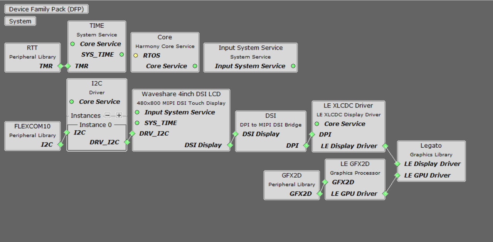

legato_qs_9x75_eb_ws_4inch.X

Defining the Architecture
-------------------------

This application demonstrates multi-layer 480x800 graphics using DDR3 memory.

The included display driver enables the display and controls backlight brightness.
User touch input on the display panel is received through the capacitive touch controller, which is polled by the display driver. The display driver reads the touch information over I2C and sends the touch event to the Graphics Library through the Input System Service.

### Demonstration Features

-   Legato Graphics Library
-   Reference application for the SAM9X75-DDR3-EB Early Access Evaluation Board
-   24-bit color, multi-layer, 480x800 screen design
-   Time system service, RTT peripheral library and driver
-   Graphics Acceleration using integrated display controller (XLCDC)
-   GFX2D GPU Driver Support
-   Waveshare 4inch DSI LCD driver

Creating the Project Graph
--------------------------
The Project Graph shows the MCC Harmony 3 components that are included in this application. Lines between components are drawn to satisfy components that depend on a capability that another component provides. The display components must be added in order, from left to right, for the display parameters to propogate correctly to the LE XLCDC driver.

The DSI cable I2C FLEXCOM10_IOx pins **PC16** and **PC17** are multiplexed using the Pin Configuration plugin and the XLCDC pixel clock is manually set to **50MHz** in the **LE XLCDC Driver** MCC component by switching the source to **PLLA/2**.

In Microchip Graphics Composer, the resolution is set to 480(W)800(H).

Building the Application
------------------------

The parent directory for this application is gfx/apps/legato\_quickstart. To build this application, use MPLAB X IDE to open the gfx/apps/legato\_quickstart/firmware/legato\_qs\_9x75\_eb\_ws\_4inch.X project folder and press F11.
A successful build will generate a harmony.bin file in dist/dsi_xlcdc_rgba8888_ws_9x75_480x800/production in the project folder.

The following table lists configuration properties:

|Project Name|BSP Used|Description|
|:-----------|:-------|:----------|
|legato\_qs\_9x75\_eb\_ws\_4inch.X|[SAM 9X75 Evaluation Board BSP](https://www.microchip.com/en-us/development-tool/EA14J50A) |[SAM9X75-DDR3-EB Early Access Evaluation Board](https://www.microchip.com/en-us/development-tool/EA14J50A) and [Waveshare 4inch DSI LCD](https://www.waveshare.com/4inch-dsi-lcd.htm) Display|

> **NOTE:** This application may contain custom code that is marked by the comments // START OF CUSTOM CODE ... and // END OF CUSTOM CODE. When using the MPLAB Code Configurator to regenerate the application code, do not remove or replace the custom code.

Configuring the Hardware
------------------------

Configure the hardware as follows:
-   Connect a Type C USB cable to power the  Waveshare 4inch DSI LCD as shown in the image below.

-   Connect the display to the evaluation board using a [22-pin to 15-pin DSI FFC cable](https://www.waveshare.com/dsi-cable-15cm.htm). Connect the 15-pin side to the display with the contacts facing up and the 22-pin side with the contacts facing away from flip-lock as shown in the image.

-	Take an SD Card formatted with the FAT32 file system and copy the boot.bin binary file from this [location](./binaries/boot.bin). Also copy the harmony.bin file you generated from the "Building the Application" section.

-   Insert the SD card into the SDMMC0 slot on the SAM9X75-DDR3-EB Early Access Evaluation Board and power up the board by connecting a Micro USB cable (5V/1A recommended) to the USB port or an adapter to the barrel jack (5V/1A recommended, Center Positive).

Running the Demonstration
-------------------------
The LCD should display a simple screen with images, text, and a button on successful power-on.

See reference image below.

* * * * *
