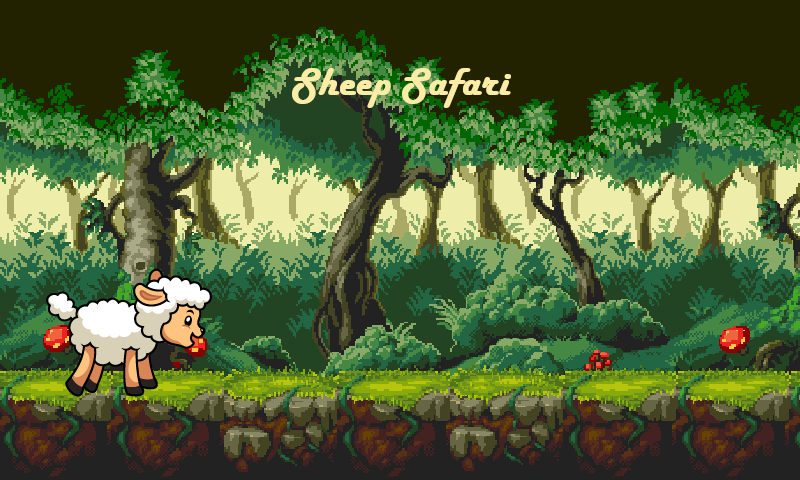
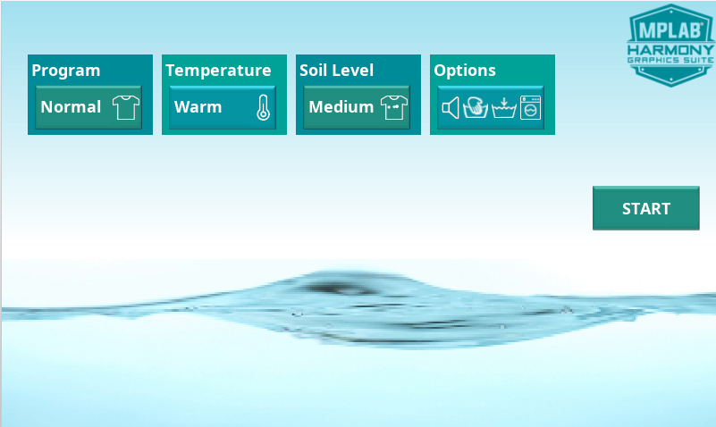

# Example Applications

## Legato Library Examples 

* [Legato Quickstart](./legato_quickstart/readme.md)

This demonstration provides a touch-enabled starting point for the legato graphics library.

* [Legato Adventure](./legato_adventure/readme.md)

This demonstration presents a minimalistic game interface utilizing parallax scrolling effect and sprite animations.

* [Legato Washing Machine](./legato_washing_machine/readme.md)

A washing machine UI with interactive controls is visulaized using legato graphics library in this demonstration. 

## LVGL Library Examples

* [LVGL Showcase](./lvgl_showcase/readme.md)

This application demonstrates a simple way to create a graphics application using the LVGL graphics library that directly uses the LCD controller driver.

