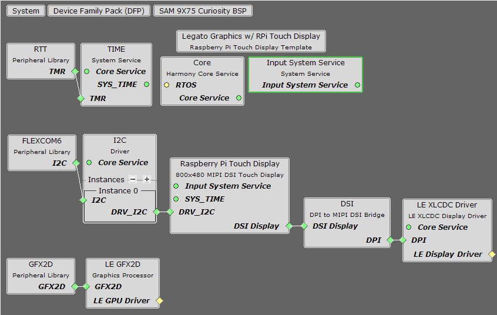
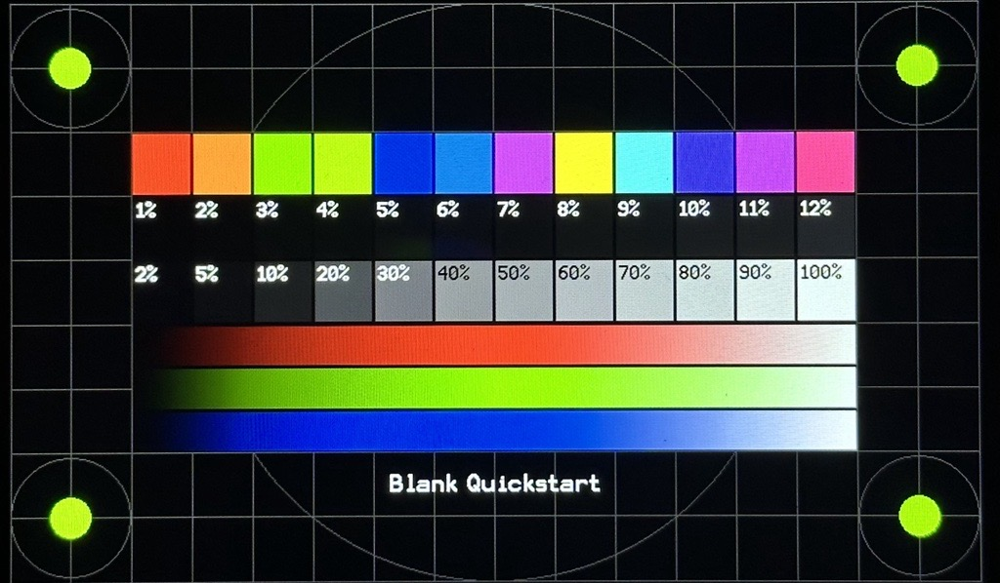

blank_qs_9x75_cu_raspi_7inch.X

Defining the Architecture
-------------------------

This application tests the display.

User touch input on the display panel is received through the PCAP capacitive touch controller, which sends a notification to the Touch Input Driver. The Touch Input Driver reads the touch information over I2C and sends the touch event to the Input System Service. Points at the corners of the display can be used to test touch functionality.

### Demonstration Features

-   Test application for the SAM9X75-Curiosity Evaluation Board
-   Test pattern that validates display and touch functionality
-   24-bit color, multi-layer, WVGA (800x480)
-   Time system service, RTT peripheral library and driver
-   Graphics Acceleration using integrated display controller (XLCDC)
-   Raspberry Pi Touch Display driver

Creating the Project Graph
--------------------------

The Project Graph diagram shows the Harmony 3 components that are included in this application. Lines between components are drawn to satisfy components that depend on a capability that another component provides.

Adding the **SAM 9X75 Curiosity BSP** and **Legato Graphics w/ RPi Touch Display** Graphics Template component into the project graph will automatically add the components needed for a graphics project and resolve their dependencies. It will also configure the pins needed to drive the external peripherals like the display and the touch controller. In this case, the Legato graphics library is disconnected and removed to test the display driver without any library.

Building the Application
------------------------

The parent directory for this application is gfx/apps/legato\_quickstart. To build this application, use MPLAB X IDE to open the gfx/apps/blank\_quickstart/blank\_qs\_9x75\_cu\_rpi_7inch.X project folder and press F11.
A successful build will generate a harmony.bin file in dist/dsi_wvga_raspi/production in the project folder.

The following table lists configuration properties:

| Project Name                      | BSP Used                                                                                        | Graphics Template Used               | Description                                                                                                                                                                                                     |
| :-------------------------------- | :---------------------------------------------------------------------------------------------- | :----------------------------------- | :-------------------------------------------------------------------------------------------------------------------------------------------------------------------------------------------------------------- |
| legato\_qs\_9x75\_eb\_rpi_7inch.X | [SAM9X75 Curiosity BSP](https://www.microchip.com/en-us/development-tool/EV31H43A) | Legato Graphics w/ RPi Touch Display | [SAM9X75 Curiosity](https://www.microchip.com/en-us/development-tool/EV31H43A) and [Raspberry Pi Touch Display](https://www.raspberrypi.com/products/raspberry-pi-touch-display/) MIPI DSI Display |

Configuring the Hardware
------------------------

Configure the hardware as follows:
-   Connect the power pins of the Raspberry Pi Touch Display (5V and GND) to the SAM9X75 Curiosity mikroBus header using jumpers.
-   Connect the display to the evaluation board using a 22-pin to 15-pin DSI FFC cable.
>Use either the [Wavehsare DSI Cable](https://www.waveshare.com/dsi-cable-15cm.htm) or the
[Raspbrerry Pi (R) Display Cable](https://www.raspberrypi.com/products/display-cable/).
- Connect the 15-pin side to the display with the contacts facing up and the 22-pin side with the contacts facing away from flip-lock.
>The flip-lock is engaged when it's at an angle (pushed down) and disengaged when flat (pulled upwards).
-	Take an SD Card formatted with the FAT32 file system and copy the boot.bin binary file from this [location](./binaries/boot.bin). Also copy the harmony.bin file you generated from the "Building the Application" section.
-   Insert the SD card into the SD BOOT slot (J12) on the board and power up the board by connecting a USB cable (5V/1A recommended) to the USB port or an adapter to the 5V DC-IN jack (5V/1A recommended, Center Positive).

Running the Demonstration
-------------------------
The LCD should display a test pattern on successful power-on. See reference image. Click the points at the corners to test touch functionality.

> **NOTE:** This display has [non-square pixels](https://forums.raspberrypi.com/viewtopic.php?t=120710). Therefore, images may appear slightly stretched across the width of the display. You can fix this by scaling **only the width** of the graphics assets down from **100% to 92.47%** in your favourite editor.

* * * * *
